# **大学生人际关系交往系统**

天津职业技术师范大学
Tianjin University of Technology and Education

- #### Java 案 例 开 发 大 作 业

- #### 专  业： 信息技术工程学院 

- #### 班级学号： 软件1701班 - 02240170128 

- #### 学生姓名：      宿 嘉      

- #### 二〇一九年十二月 


## 1. java案例开发大作业简介

   * 题目:大学生人际关系跟踪系统

## 1.2 摘要
* 人际关系追踪系统，通过对注册用户的问卷调查测评，使用系统中的留言板、好友列表、聊天室功能，后台监控数据，给与用户最终的人际关系分析结果。
* 人际关系追踪系统，包括普通用户和管理员。普通用户注册后，可以完善信息，填写调查问卷，查看自己的留言板，在好友系统中添加好友，根据基本信息添加好友，发送好友申请，接受好友申请，可以给不同用户发送留言。可以使用聊天室功能进行网页在线聊天。管理员登录后可以根据不同条件，按需查询到所有用户，并分页展示信息，以及测评分数，管理员可以查看统计页面，注册人数中答题人数百分比，聊天室的聊天记录监控，后台通过自定义算法实现对用户的测评。

* 关键词：人际关系交往；问卷调查；Spring-boot+Vue

## 1.3 目录
[TOC]

## 1.4  引言

- ​	上大学，除了学习知识以外，最关键也是最基本的是人的能力，其中人际交往能力的培养尤为重要。我们大学生作为社会主义建设事业的接班人建立良好的人际关系尤为重要。大学是人际关系走向社会化的重要转折时期，踏入大学，就会遇到各方面的人际关系；师生之间。同学之间，以及个人与班级、学校之间的关系等等。大学生人际关系至关重要，为了探究大学生人际关系情况，制作了大学生人际关系交往系统，通过网页中功能操作收集数据，进行算法分析，统计使用者的人际关系情况，以供学校等采取相应的对策解决问题，优化策略。
  	要想收集足够有用的数据，就要分析现在大学生的人际交往方式，除了日常交流，大学生重要的交流方式还有上网。
    研究此系统的目的是为了收集大学生的一些基本信息，记录他们使用本系统的侧重功能，使用频率，通过调查问卷反应实际情况，针对当代大学生，少有前人写相关综合系统，缺乏对大学生人际关系的综合分析。
  	研究设想：通过后台监控，反应出注册用户的答题情况，每间隔一段时间，统计其使用聊天室的频率，发言内容，留言板条数，好友个数等进行分数调整，预期结果，在管理员页面中可以动态的看出百分比变化，得出统计数据大致范围。

- ​        意义：通过对人际关系的追踪，良好的人际关系能够促进人们共同协作，为完成特定的任务而共同奋斗。现代科学技术的发展，既为交往创造了快捷方便的条件，也对交往方式提出了更高的要求。现在许多社会工作任务，越来越不能靠单个人单枪匹马来完成要通过众多人的共同协作来完成。每个科研项目的攻关，也离不开众多科学家的联手合作，加强联系，共同研究。
  良好的人际关系能够促进人们之间的信息交流和信息共享。现代社会知识量激增，“信息爆炸”，不建立一个和谐的人际关系进行交往，就不能尽快获得信息。有人曾说，现代社会80%的信息是通过交往获得的。而在现代社会掌握了信息就等于增加了成功的砝码。
  　　人们可以从友好协作的人际关系中吸取力量，增强信心，在人生业绩的创造中左右逢源，得心应手。反之，如果人与人之间互相拆台，互相牵制，积极性受到压抑，才能无法发挥，消磨意志，空耗时光，则根本谈不上人生业绩的创造。

  ```
  用户体验网址：
  http:47.93.225.242:8080/Login
  管理员页面：
  http:47.93.225.242:8080/LoginAdmin
  账号admin 密码password
  ```

## 1.5  正文

### 1.5.1 项目主要功能

* 项目分为普通用户和管理员两个界面。

* 普通用户注册登录后可进行完善信息、问卷调查、查看分析、添加好友、发起群聊。管理员登录后可以查看所有的注册用户信息，查看分析百分比，聊天室记录监控。

### 1.5.2 系统界面截图

* 普通用户登录界面：为了模拟两个用户互动，我需要两个账号，一个是系统中已经有的以我的个人信息展示，另一个是重新注册用的test1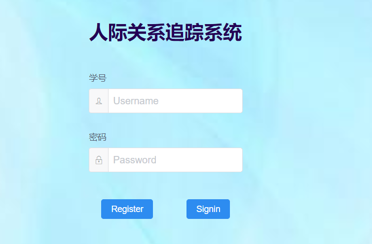

    注册界面：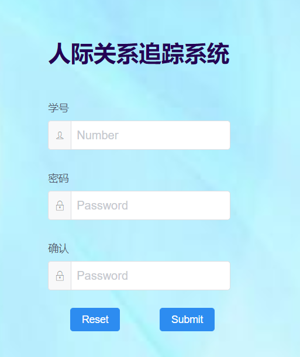

* 完善信息页面：录入学生信息，并有相应的格式提示，表单验证。若不完善信息，无法使用其他模块，都会跳到当前页面。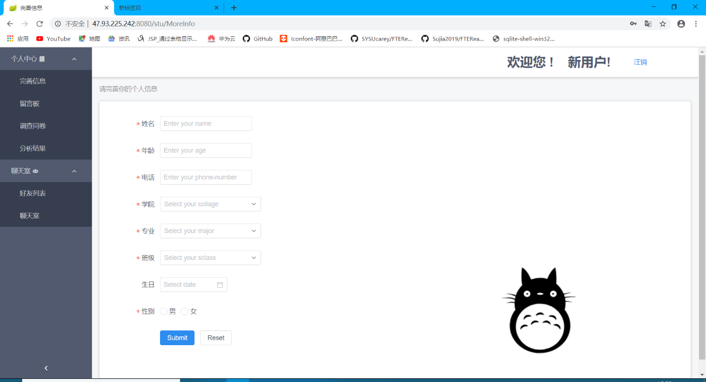

* 调查问卷：一共20道题，做了分页，答完题之后会出现分析结果，答完题之后不可再答，再点击也是分析结果的页面。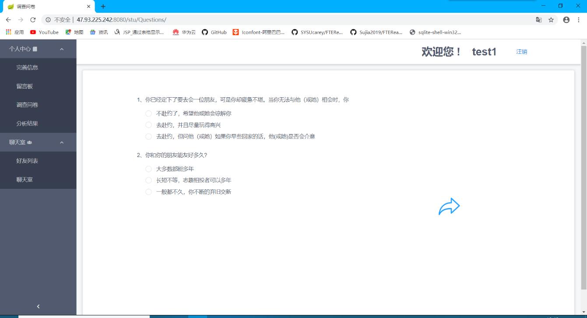


* 好友列表模块：
  1.	查找用户并提交好友申请
     .	好友申请列表：可以查看详情，接受或拒绝好友。 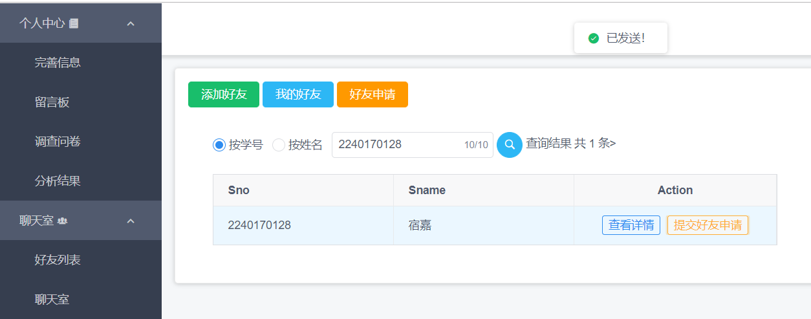
     .	查看我的好友并发送留言信息：


* 留言板模块：会有徽标提示，同样，当有新的好友申请也会有相应的提示。

  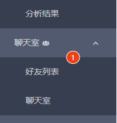

  

  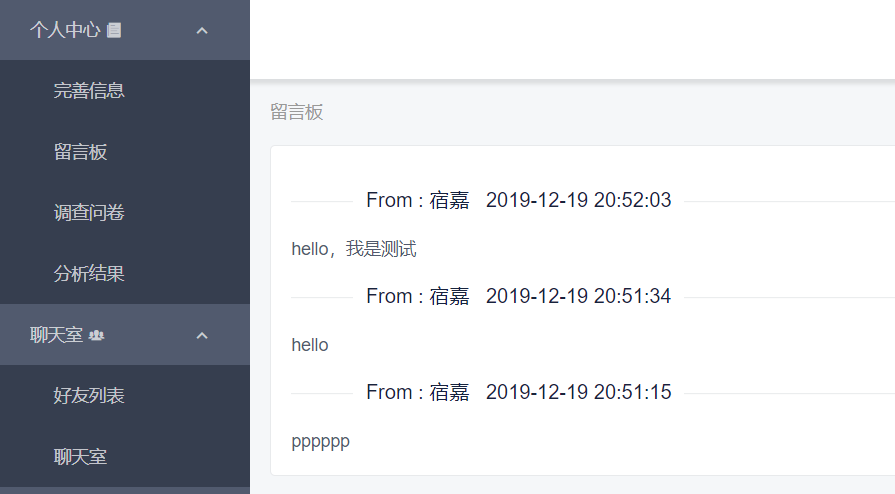


* 聊天室模块：基本的功能已实现，UI设计较简单，是个基于websocket的网页群聊。

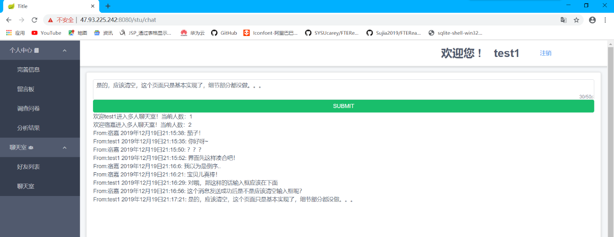


管理员页面：查询用户（可按学号、姓名、班级、学院进行不同的条件模糊查询）
分页显示基本信息，点击查看详情还可以看到详细信息包括他的留言板


删除用户：

统计分析：测试数据较少 


### 1.5.3 系统流程图

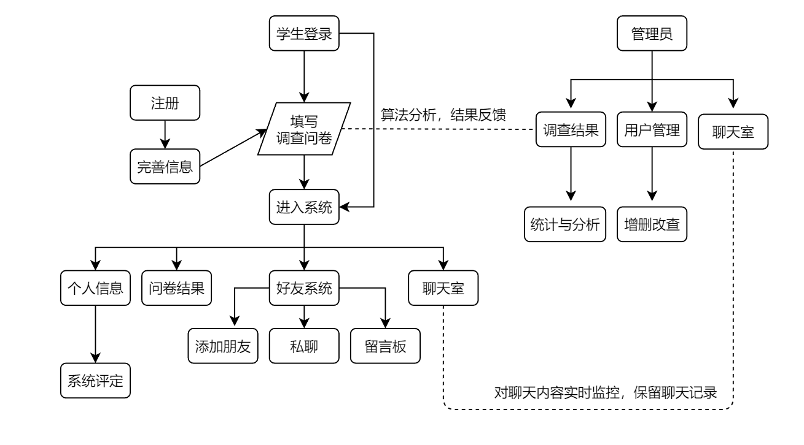

### 1.5.4 实体类设计

1、Admin管理员
		id、username、password
2、	User 用户基本信息
       与数据表中UserInfo一致
3、	UserBoard
与数据表中UserBoard一致
4、	UserShow
用于展示某些页面中需要的信息，由于不需要展示User的全部信息，还需要展示一些其他表中信息，所以独立出来的新的实体类。
5、	BoardMsg
@Data
public class BoardMsg {
    private String sno;
    private String from_name;
    private String board_text;
    private String date_time;
}
6、	Questions
@Data
public class Question implements Serializable {
    private int QuestionID;//题号
    private String Title;
    private List<Answer> answers;
    private boolean isFinished = false;
}
7、	Answer
@Data
public class Answer {
    private int AnswerID;//答案号
    private String context;
    private int score;
    private boolean isChoose =  false;
}
8、	ReturnAnswer：前端提交的答题情况，用于作分数加减 分析。

```java
@Data
public class ReturnAnswer {
    private int questionID;
    private int answerID;
    private int score;
}
```
9、	AnalyzingData：将统计数据返回给管理员页面的实体类
```java
@Data
public class AnalyzingData {
    private int allCount;
    private double percent;
    private int finishedCount;
    private int countA;
    private int countB;
    private int countC;
    private int countD;
    private double percentA;
    private double percentB;
    private double percentC;
    private double percentD;
}
```

10、	Tips：徽标提示类，用数目绑定学号 返回一个小对象
```java
@Data
public class Tips {
    private int count;
    private String sno;
}
//FriendRequest
@Data
public class FriendRequest {
    private String sno1;
    private String sno2;
    private boolean addStatus;//  1:已通过   0:待处理
}
```

### 1.5.5 数据表设计

​     数据库共有六张表

管理员表：

用户基本信息表：UserInfo  个人基本信息

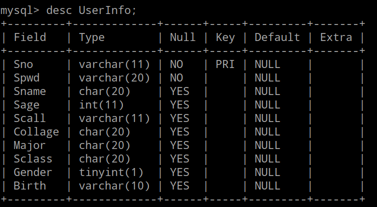

用户业务信息表：UserBoard
   		用于与业务相关的操作，用户数据表纵切分表，减少查询消耗


问题表：Questions
用于存调查问卷的名字和存储位置）


留言信息表：Board_Msg
存储每一条留言，包括发信人收信人 内容及时间


好友关系表：pyq
		用于完成好友列表里的操作
		好友关系是双向的，成功添加好友后数据表中应出现两条数据。
		addStatus用于代表添加好友的状态，是接受还是未接受，成功为1，未处理为0，若拒绝则直接删除记录。


### 1.5.6 技术支持

​    

    大学生人际关系追踪系统，所用到的技术有spring-boot+Vue+Mybatis，
    springMVC以及整合了redis用于缓存客户端session信息，数据库使用mysql8版本，整体代码完成于Linux系统，使用idea编译器，maven工程快速打包，并上传到了自己租用的阿里云服务器上。本项目的地址也在github上发布， 旨在练习！ 练习！ 练习！ 练习！
    详情github: https://github.com/Sujia2019/mydemo
    spring-boot以其简洁、轻快的特点迎得开发者的支持。它能帮我们快速构建服务，为后端开发提供了大量的便利。当我需要集成哪些部件时，只需要在pom文件中添加依赖，在配置文件中添加相应配置，spring-boot即可自动托管代码。
* src/main/java：主程序入口Application，可以通过直接运行该类来 启动 Spring Boot应用
* src/main/resources：配置目录，该目录用来存放应用的一些配置信息，比如应用名、服务端口、数据库配置等。由于我们应用了Web模块，因此产生了 static目录与templates目录，前者用于存放静态资源，如图片、CSS、JavaScript等；后者用于存放Web页面的模板文件。
* src/test：单元测试目录，生成的 JdemoApplication 通过 JUnit4实现，可以直接用运行 Spring Boot应用的测试。
* application.properties : 保存数据库链接信息等应用程序数据,服务器，端口号
* pom.xml : 工程的包名、版本、依赖等信息
* 前端框架使用iview进行页面渲染，语法使用Vue。
	```
	Vue是一款友好的、多用途且高性能、渐进式的JAVASCRIPT框架。可以将vue当作一项应用嵌入服务端，带来更加丰富的交互体验。并且vue的核心库及生态系统可以帮助实现许多的前端业务逻辑。每一个组件都是可复用的以渲染页面中不同的部分。
	```
* 所有的前后端交互都是采用ajax异步提交，传送json数据。
	```
	        为同步数据，增加了redis数据库用于缓存客户端的session，session中保存着用户操作中所需要保存的一些业务信息。
	    对于数据库的操作，选用MyBatis。MyBatis 是一款优秀的持久层框架，它支持定制化 SQL、存储过程以及高级映射。MyBatis 避免了几乎所有的 JDBC 代码和手动设置参数以及获取结果集。MyBatis 可以使用简单的 XML 或注解来配置和映射原生类型、接口和 Java 的 POJO（Plain Old Java Objects，普通老式 Java 对象）为数据库中的记录。使用MyBatis用法先配置Mybatiscfg，存连接数据库的信息。在mapper.xml中添加sql语句，这样做的优点是便于修改代码，直接在配置文件中修改/添加sql语句，并且通过xml的配置，可以方便的通过不同条件查找，只需要表属性名和实体类的属性名一一对应即可，并且返回的类型也可以多样化，可以返回一个实体类中属性带有map或list的对象。
	    Maven的快速打包也是相当轻便，spring-boot项目中不需要使用tomcat，引入web依赖后spring内置tomcat，maven会将所有需要用的包管理在一起打成一个jar包，传到服务器上后只需要nohup java-jar xxx.jar &即可在后台启动，输入网址即可直接访问页面。
	    Spring MVC 分离了控制器、模型对象、过滤器以及处理程序对象的角色，这种分离让它们更容易进行定制。在项目使用中只需要一些@注入即可实现大部分功能。
  ```

### 1.5.7 项目结构

​	Java代码和配置文件。


​	运用MVC设计模型，前后端分离。


     主要java代码分为
    	Controller控制层
    	Service业务层
    	Entity实体类
    	Dao持久化
    	Util工具类
    	WebSocket配置


实体类

Controller  Dao：

工具类和websocket：

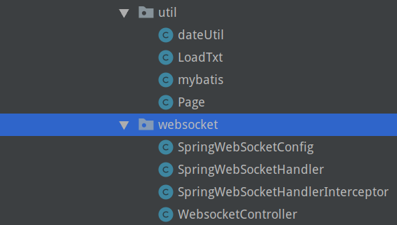

### 1.5.8 核心代码

​	登录页，获取前端传来的sno和pwd，交给service层判断，Dao层负责查库将数据返给service层。将结果层层返回，验证成功后将用户信息保存在session中。

```
    @RequestMapping(value = "ok" ,method = RequestMethod.POST)
    @ResponseBody
    public Object ok(@RequestParam String Sno, String Spwd){
        User user;
        Object obj = userService.login(Sno,Spwd);
        if (obj.equals(1)||obj.equals(0)){
            return obj.toString();
        }
        HttpSession session = request.getSession();
        user=(User)obj;
        session.setAttribute("user",user);
        return user;
    }//用户登录
    
//    	其他添加用户、删除用户、查询用户类似，不再赘述。
//    	跳转页面直接返回页面的名字 如：
    	//返回问题页面
     @RequestMapping(value = "Questions")
     public String Questions(){
        return "stu/Questions";
     }
    //与resource中templates文件夹下stu/Questions.html对应
	
```


	获取题目的方法：从数据库中获取题目的位置，然后查文件
##Controller层

```
   	@RequestMapping("show")
    @ResponseBody
    public List showQuestions(@RequestParam int curr,int pageSize){
        return questionService.showQuestion(curr,pageSize);
    }
//调用service层（QuestionServiceImp.java）
   static List list =questionDao.questionList();
```


 		

        public List showQuestion(int curr,int pageSize) {
        	return Page.pageDiv(curr,pageSize,list);
        }
##调用Dao层拉取信息，工具类load文件

```
(QuestionDaoImp,LoadTxt.java)
    @Override
    public List questionList() {
        String str = sqlSession.selectOne("loadAnswers");
        System.out.println(LoadTxt.ReadQuestions(str));
        return LoadTxt.ReadQuestions(str);
    }
    public static List<Question> ReadQuestions(String url){
        List<Question> questions = new ArrayList<>();
        try {
            ClassPathResource classPath = new ClassPathResource(url);
            InputStream in = classPath.getInputStream();
            ````
            while ((str=br.readLine())!=null){
                if(```)){
```
                }else if (str.contains("//")) {
    					```
                }
            }
        } catch (Exception e) {
            e.printStackTrace();
        } 
        return questions;
    }
```

##调用静态方法分页通用分页方法(Page.java)

```
  public static List pageDiv(int currPage,int pageSize,List list ){
        int firstIndex = (currPage - 1) * pageSize;
        int lastIndex = currPage * pageSize;
        try{
            return list.subList(firstIndex,lastIndex);
        }catch(Exception e){
            return list.subList(firstIndex,list.size());
        }
    }
```

##分数计算及返回，落库（service）

```
    @Override
    public UserBoard addScores(String sno,List<ReturnAnswer> list) {
        int scores = 0;
        for (ReturnAnswer returnAnswer : list) {
            scores += returnAnswer.getScore();
        }
        return userDao.setScores(sno,scores);
    }
    public AnalyzingData analyzingRes(){
        AnalyzingData data = new AnalyzingData();
        int finishedCount=findAllFinished();
        int allCount=findallcount();
        data.setAllCount(allCount);
        data.setFinishedCount(finishedCount);
        data.setPercent(percent(finishedCount,allCount));
    	 ……
        return data;
    }
```


​    数据表更新分数

```
 @Override
    public UserBoard setScores(String sno,int scores){
        UserBoard userBoard = new UserBoard();
        userBoard.setSno(sno);
        userBoard.setIsFinishedQuestion(true);
        userBoard.setScores(scores);
        sqlSession.update("updateFinishedQuestion",userBoard);
        sqlSession.commit();
        return userBoard;
    }
```

##mapper中xml配置
```
    <update id="updateFinishedQuestion"
    parameterType="Com.easyArch.entity.UserBoard">
        update SSHpro.UserBoard SET
        IsFinishedQuestion=#{isFinishedQuestion},
        Scores=#{scores}
        where Sno = #{sno}
    </update>
```


##其他业务逻辑：
1、	留言板
```
  //添加一条留言
    @Override
    public boolean addBoardMsg(BoardMsg msg) {
        msg.setDate_time(dateUtil.sendDate());
        return userDao.insertBoardMsg(msg);
    }
```
2、	添加好友，发送好友申请，删除好友
```
  //发送好友申请
    @Override
    public boolean addRequest(String sno1, String sno2) {
        FriendRequest request = new FriendRequest();
        request.setSno1(sno1);
        request.setSno2(sno2);
        request.setAddStatus(false);
        userDao.addRequest(request);
        return true;
    }
//接受好友申请
    @Override
    public boolean acceptRequest(String sno1, String sno2) {
        FriendRequest request = new FriendRequest();
        request.setSno1(sno1);
        request.setSno2(sno2);
        request.setAddStatus(true);
        userDao.acceptRequest(request);
        return true;
    }
```
3、	消息提示
```
//留言提示
@Override
public int tipMsgCount(String sno) {
    	int count1=userDao.countBoardMsg(sno);
    	countMsg=userDao.historyMsgCount(sno);
        if(count1>countMsg){
            return count1-countMsg;
        }else{
            return 0;
        }
    }
//好友提示
    @Override
    public int tipRequestCount(String sno) {
        int count1=userDao.countRequest(sno);
        countRequest=userDao.historyRequestCount(sno);
        if(count1>countRequest){
            return count1-countRequest;
        }else{
            return 0;
        }
    }
```
4、	Vue组件及ajax请求
```
//定义vue，绑定div的id
    var mVue = new Vue({
        el:'#app',
        data(){
            return{
                vertical1: '',
                vertical2:'',
                message:'',
                info:'',
                isCollapsed: false,
                curr:1,
                pageSize:2,
                question1:{
                    questionID:'',
                    answers:[],
                    title:'',
                    finished:''
                },
                question2:{
                    questionID:'',
                    answers:[],
                    title:'',
                    finished:''
                }
            }
        },
        computed: {
            menuitemClasses: function () {
                return [
                    'menu-item',
                    this.isCollapsed ? 'collapsed-menu' : ''
                ]
            }
        },
        methods:{
            handleSubmit(){
//ajax异步请求
                $.ajax({
                    url:'/stu/Questions/sendAnswers',
                    type:'post',
                    contentType:
"application/json;charset=UTF-8",
							//将字符串类型转成json
                    data: JSON.stringify(answerList),
                    success(res){
                        alert("恭喜你提交成功！");
                        Analyzing();
                    }
                })
            }
        }
    });
```
5、	聊天室websocket（重点：SpringWebSocketHandler.java）

    /**
     * js调用websocket.send时候，会调用该方法
     */
    @Override
    protected void handleTextMessage(WebSocketSession session, TextMessage message) throws Exception {
        sendMessageToUsers(message);
        super.handleTextMessage(session, message);
    }
    /**
     * 给所有在线用户发送消息
     * @param message
     */
    public void sendMessageToUsers(TextMessage message) {
        for (WebSocketSession user : users) {
            try {
                if (user.isOpen()) {
                    user.sendMessage(message);
                }
            } catch (IOException e) {
                e.printStackTrace();
            }
        }
    }


## 1.6 结论及体会

​	测评结果显示，半数以上的人人际关系测评结果为B类型：人际交往能力较强。
	完成此次大作业，熟练掌握MVC设计模型，理解前后端分离的优势。Ajax异步请求的快捷，掌握spring-boot快速搭建web项目。Mybatis操作数据库，深刻理解sqlsession事务的特点，锁功能，查库数据要保持同步，那么代码就要写的灵活，sqlsession在进行写的操作时不可读取，即使commit已经提交到数据库，另一个sqlsession也不可操作此表查到刚插入或更新的数据。这就导致我在写代码时，经常遇到数据不同步问题，答题后当前用户可以看到答题结果，但管理界面显示此人尚未答题。需要做缓存，做数据共享。
	从0开始学spring-boot及前端ajax传值，js框架vue，着实花了不少功夫，鸭子类型各种未定义也让我头疼了许久，对前后端传值时的json数据不够理解。Spring-boot，Spring-MVC集成mybatis的一个重要特点是映射，做好一一对应关系。Mapping一一对应是关键。
	

	Spring-boot还有很多方便的注解，如@Data的注入可以自动生成getter setter，实体类需要序列化，在pom注解中添加所需依赖，主要的有
	//启动依赖
	   <dependency>
	        <groupId>org.springframework.boot</groupId>
	        <artifactId>spring-boot-starter-cache</artifactId>
	    </dependency>
	    <dependency>
	        <groupId>org.springframework.boot</groupId>
	        <artifactId>spring-boot-starter-thymeleaf</artifactId>
	    </dependency>
	    <dependency>
	        <groupId>org.projectlombok</groupId>
	        <artifactId>lombok</artifactId>
	        <optional>true</optional>
	    </dependency>
	    <dependency>
	        <groupId>org.springframework.boot</groupId>
	        <artifactId>spring-boot-devtools</artifactId>
	        <scope>runtime</scope>
	        <optional>true</optional>
	    </dependency>
	//web服务依赖，内置tomcat
	    <dependency>
	        <groupId>org.springframework.boot</groupId>
	        <artifactId>spring-boot-starter-web-services</artifactId>
	    </dependency>
	    <dependency>
	        <groupId>org.springframework.boot</groupId>
	        <artifactId>spring-boot-starter-tomcat</artifactId>
	        <scope>provided</scope>
	    </dependency>
	//操作数据库
	    <dependency>
	        <groupId>mysql</groupId>
	        <artifactId>mysql-connector-java</artifactId>
	        <scope>runtime</scope>
	    </dependency>
	    <dependency>
	        <groupId>org.mybatis</groupId>
	        <artifactId>mybatis</artifactId>
	        <version>3.2.8</version>
	    </dependency>
	//session与redis缓存
	    <dependency>
	        <groupId>org.springframework.session</groupId>
	        <artifactId>spring-session-data-redis</artifactId>
	    </dependency>
	//json
	    <dependency>
	        <groupId>com.fasterxml.jackson.core</groupId>
	        <artifactId>jackson-core</artifactId>
	        <version>2.9.7</version>
	    </dependency>
	//spring集成websocket
	    <dependency>
	        <groupId>org.springframework</groupId>
	        <artifactId>spring-websocket</artifactId>
	        <version>5.1.10.RELEASE</version>
	    </dependency>
		……
		……等
	
	//maven编译插件
	<build>
	    <plugins>
	        <plugin>
	            <groupId>org.springframework.boot</groupId>
	            <artifactId>spring-boot-maven-plugin</artifactId>
	        </plugin>
	    </plugins>
	</build>

## 1.7 参考文献

	Spring-boot 快速开始
	https://www.jianshu.com/p/20b824539762
	MyBatis官方文档
	
	https://mybatis.org/mybatis-3/zh/index.html
	Vue.js官方文档
	https://cn.vuejs.org/
	websocket网页聊天室
	https://github.com/lenve/vhr

## 1.8 附录

​	所有service及dao层接口

1、	FriendsService.java
    int countFriends(String sno);//好友数量
    boolean addFriend(String sno1,String sno2);
    String friendhandler();//处理好友申请
    List<String> showAdd();//展示好友申请列表

2、	QuestionService.java
List showQuestion(int curr,int pageSize);

3、	UserService.java
    int times=0;
    void setTimes(int times);
    User addUser(String sno, String pwd);
    boolean delUser(String sno);
    List<UserShow> findAll();
    List<UserShow> findUsersBySno(String sno);
    List<UserShow> findUsersByName(String name);
    List<UserShow> findUsersByAge(int age);
    List<UserShow> findUsersByCollage(String collage);
    List<UserShow> findUsersByClass(String sclass);
    User findUserBySno(String sno);
    Object login(String username, String pwd);
    Admin adminLogin(String username, String pwd);
    boolean updateUser(FormValidate user);
    int findallcount();
    int findAgeCount(int age);
    int findNameCount(String name);
    int findCollageCount(String collage);
    int findClassCount(String sclass);
    int findSnoCount(String sno);
    int findFriendsCount(String sno);
    int countRequest(String sno);
    UserBoard addScores(String sno, List<ReturnAnswer> list);
    String returnResult(String sno);
    boolean isFinished(String sno);
    List<BoardMsg> showBoardMsg(String sno);
    boolean addBoardMsg(BoardMsg sno);
    int boardMsgCount(String sno);
    int tipMsgCount(String sno);
    int tipRequestCount(String sno);
    int historyMsgCount(String sno);
    int historyRequestCount(String sno);
    boolean addRequest(String sno1,String sno2);
    boolean acceptRequest(String sno1,String sno2);
    boolean refuseRequest(String sno1,String sno2);
    boolean delFriend(String sno1,String sno2);
    int findAllFinished();
    double percent(int a,int b);
    AnalyzingData analyzingRes();
    List findpage(int start, int end);
    List<User> showFriends(String sno);
    List<User> showFriendsRequest(String sno);
        List<UserBoard> findUserBoard(String sno);

4、	FriendsDao.java
    int countFriends(String sno);
    List<User> friendList(String sno);
    List<User> friendRequestList(String sno);
    User findUserBySno(String sno);
    boolean delFriends(FriendRequest del);

5、	QuestionDao.java
List questionList();

6、	UserDao.java

    //对数据库操作的接口
    int addUser(User user, UserBoard userBoard);//注册
    boolean deleteUser(String id);
    List<UserShow> findAll();//管理员查所有成员 简单分页
    List<UserShow> findUsersBySno(String sno);
    List<UserShow> findUsersByName(String name);
    List<UserShow> findUsersByAge(int age);
    List<UserShow> findUsersByCollage(String collage);
    List<UserShow> findUsersByClass(String sclass);
    String findUserNameBySno(String sno);
    User login(String username, String pwd);
    Admin adminlogin(String username, String pwd);
    boolean updateUser(User user);
    int findSnoCount(String sno);
    int findallcount();
    int findAllFinished();
    int findAgeCount(int age);
    int findNameCount(String name);
    int findCollageCount(String collage);
    int findClassCount(String sclass);
    int findFriendsCount(String sno);
    
    UserBoard setScores(String sno,int scores);
    int searchScore(String sno);
    boolean isFinished(String sno);
    List<BoardMsg> showBoardMsg(String sno);
    boolean insertBoardMsg(BoardMsg msg);
    int countBoardMsg(String sno);
    int countRequest(String sno);
    int historyMsgCount(String sno);
    int historyRequestCount(String sno);
    int setHistoryMsgCount(Tips tips);
    int setHistoryRequestCount(Tips tips);
    boolean addRequest(FriendRequest request);
    boolean acceptRequest(FriendRequest request);
    boolean refuseRequest(FriendRequest request);
    List<UserBoard> findUserBoard(String sno);
    User findUserBySno(String sno);
        List<Integer> findScore();
## 1.9 致谢

​	感谢老师对MVC思想的灌输，刚开始非常不理解一些抽象概念。
	感谢网上一些博客的分享，解决了很多问题。
	感谢Github开源社区，给我提供了很多思路，也有源码展示。

	我的项目完整代码也放在了Github上
	https://github.com/Sujia2019/mydemo

如有需要可以根据此篇设置数据库表，启动redis即可直接使用target中的jar包运行。Websockt可配置自己的服务器地址或localhost。

```
